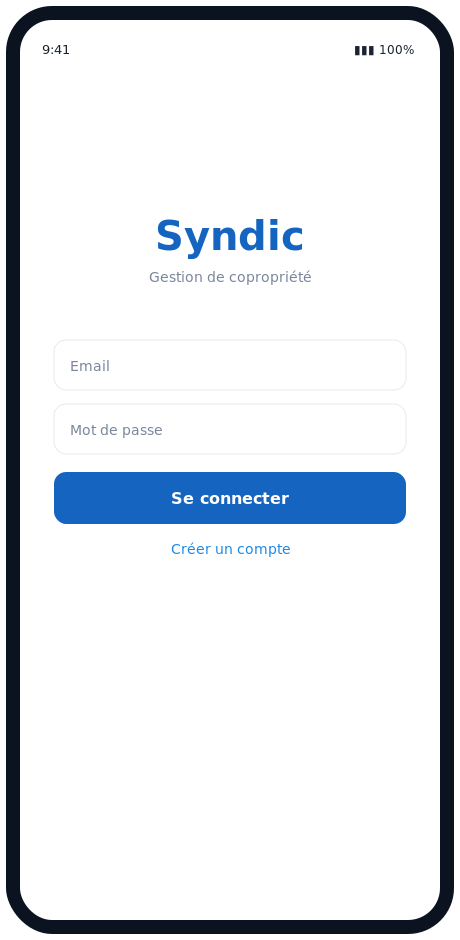
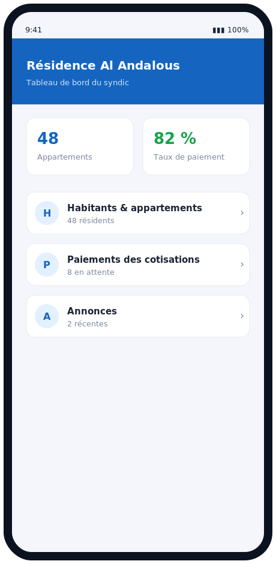
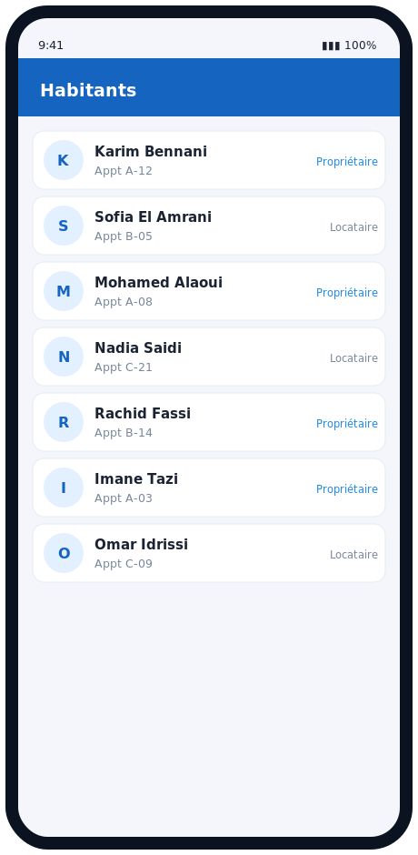
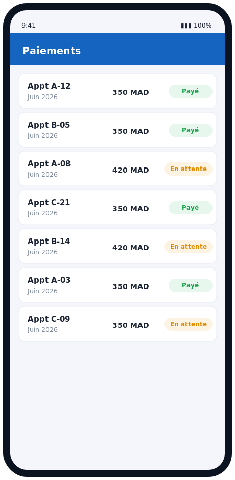

# Gestion de Syndic — Application Android

Application mobile de gestion de résidence (syndic de copropriété) : suivi des habitants, des appartements, des paiements de cotisations et des annonces. Développée en **Java** (Android Studio) avec **Firebase** (Authentication + Cloud Firestore).

> Projet académique de Badr Chigar — Ingénieur d'État en Informatique (EMSI Casablanca).

## Captures d'écran

<p>
  
  
  
  
</p>

## Fonctionnalités
- **Authentification** Firebase (connexion / inscription du syndic et des résidents).
- **Tableau de bord** : nombre d'appartements, taux de paiement, annonces récentes.
- **Habitants & appartements** : liste, ajout, détails (RecyclerView).
- **Paiements** : suivi des cotisations mensuelles (payé / en attente) par appartement.
- **Annonces** : publication d'informations aux résidents.
- Données synchronisées en temps réel via **Cloud Firestore**.

## Stack
| Couche | Technologies |
|--------|--------------|
| Langage | Java |
| UI | Android SDK, Material Design, RecyclerView, ConstraintLayout |
| Backend | Firebase Authentication, Cloud Firestore |
| Build | Gradle |

## Structure
```
app/src/main/
├── AndroidManifest.xml
├── java/ma/syndic/
│   ├── activities/   LoginActivity, DashboardActivity, HabitantsActivity, PaiementsActivity
│   ├── adapters/     HabitantAdapter, PaiementAdapter (RecyclerView)
│   └── model/        Habitant, Appartement, Paiement, Annonce
└── res/
    ├── layout/       activity_*.xml, item_*.xml
    └── values/       strings, colors, themes
```

## Configuration Firebase
1. Créer un projet sur [Firebase Console](https://console.firebase.google.com).
2. Ajouter une application Android avec le package `ma.syndic`.
3. Télécharger `google-services.json` et le placer dans `app/`.
4. Activer **Authentication** (Email/Password) et **Cloud Firestore**.

## Build & exécution
Ouvrir le projet dans **Android Studio**, synchroniser Gradle, puis lancer sur un émulateur ou un appareil.

## Licence
MIT © Badr Chigar
